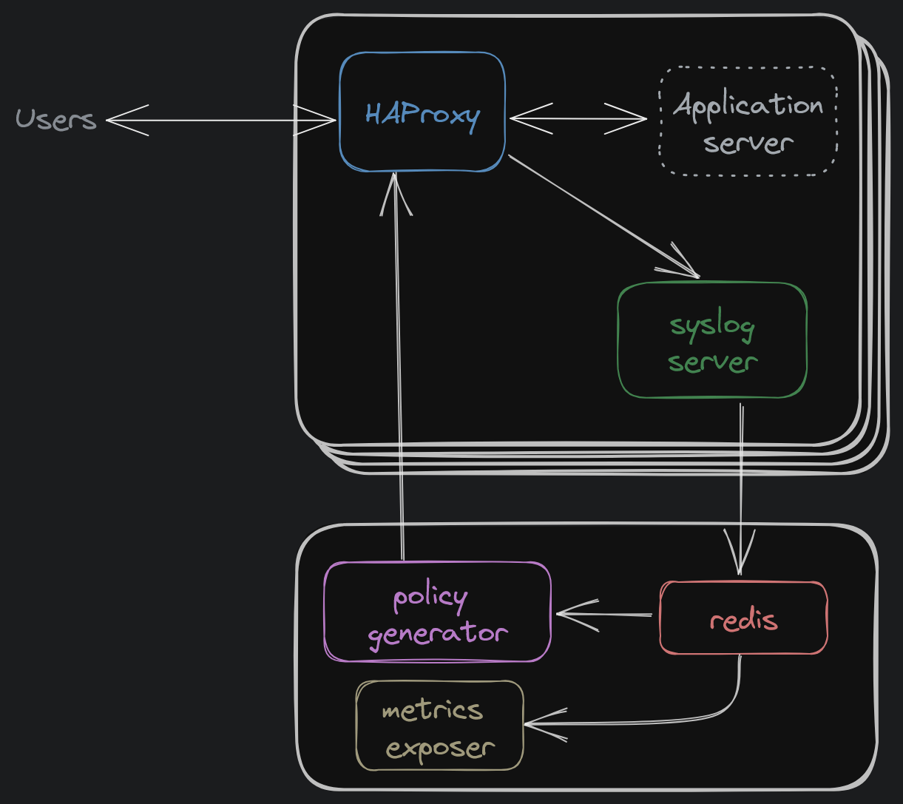

# Architectural Overview of the Weir QoS Framework

This framework is designed to provide Quality of Service for a cluster of HTTP
servers at a per-user level (rather than a per-IP level), where a "user" is defined by some unique key provided in each request.
For example, users accessing an [S3 endpoint](https://docs.aws.amazon.com/AmazonS3/latest/userguide/Welcome.html)
would be identified by their [access keys](https://docs.aws.amazon.com/IAM/latest/UserGuide/security-creds.html).

Each user can have different types of limits applied to them:

- Bandwidth limit (e.g., 50MB/s of total upload)
- Request rate limit (applied per HTTP verb, e.g., 100 GET requests/s)
- Concurrent request limit (e.g., 10 active requests running concurrently)

These limits are all defined for each user and enforced cluster-wide, meaning that
aggregate usage for that user across all HTTP servers will be restricted so as not to exceed
these limits.

## High-level Methodology

We take a reactive approach to rate limiting, rather than a proactive one.
This means that, rather than consult a central store in a blocking fashion before enacting each request,
we permit all requests by default and collect the corresponding usage data. Once a user exceeds their limit,
we throttle them to bring them back in line with their intended limits.

## System Components

Weir QoS has 4 main components:

- [HAProxy](https://www.haproxy.org/), for which we include some minor modifications to report usage and enforce limits and extended with Lua scripts for logic specific to your use case
- [Redis](https://redis.io/), which stores all of the observed usage across the system
- [A custom syslog server](#syslog-server), which collects logs and usage data from HAProxy and aggregates it into Redis
- [A "Policy Generator"](#policy-generator), which continuously checks Redis for updated usage data and sends "policies" back to HAProxy for it to throttle the appropriate users

There's also a separate "metrics exposer" that reads usage data from Redis and makes it available as Prometheus-compatible metrics.

The diagram below shows how these components fit together:

### HAProxy

HAProxy runs on each HTTP server and forwards incoming requests to the local application server.

To do this, we use a version of HAProxy that has:

1. Had its source modified slightly to emit necessary control messages as logs and to provide additional bandwidth-limiting functionality
1. Been extended with Lua scripts to handle some of the generic request-limiting logic, to provide the logic that is specific to your use case (e.g., for extracting user keys from each request), and to listen for incoming control messages from the [policy generator](#policy-generator)
1. Been configured to send log messages to the local instance of the [weir syslog server](#syslog-server)

### Syslog Server

Syslog-server runs locally with each HAProxy instance and handles the logs emitted by HAProxy.
Regular log messages are written to disk as usual, but control messages are transformed into the appropriate updates to be submitted to Redis.

Some examples of such control messages are:

- `req` which provides all the relevant information about a request when it begins
- `data_xfer` which communicates how much data a user has recently transferred

### Redis

Redis runs on a central server and aggregates all of the usage data sent (via syslog server) from HAProxy.

Data is aggregated separately for each user and for each type of usage (e.g., quantity of data transferred, number of requests made recently, current number of active requests).

### Policy Generator

Policy generator (or 'polygen' for short) continuously reads all of the aggregated usage data from Redis and compares that to the data it has about each user's limits, resulting in a set of commands to be sent back to each HAProxy instance to update the way it responds to client requests.

The limit data is provided in the form of a JSON file that is loaded on startup and can be reloaded on-demand at runtime in case it gets updated. Any user not explicitly assigned a set of limits will fall back to a default limit that also forms part of that configuration.
