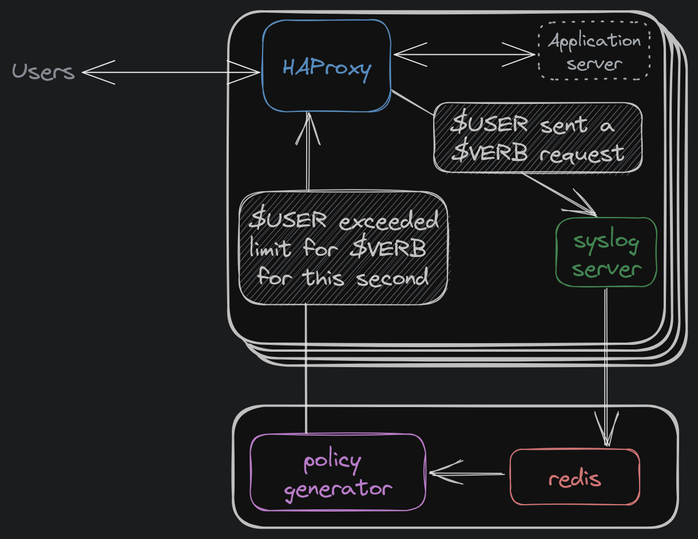
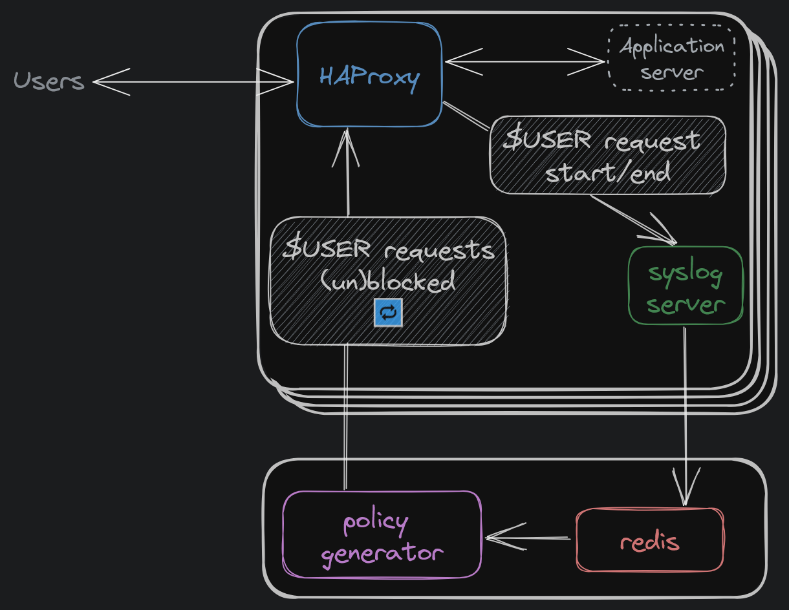
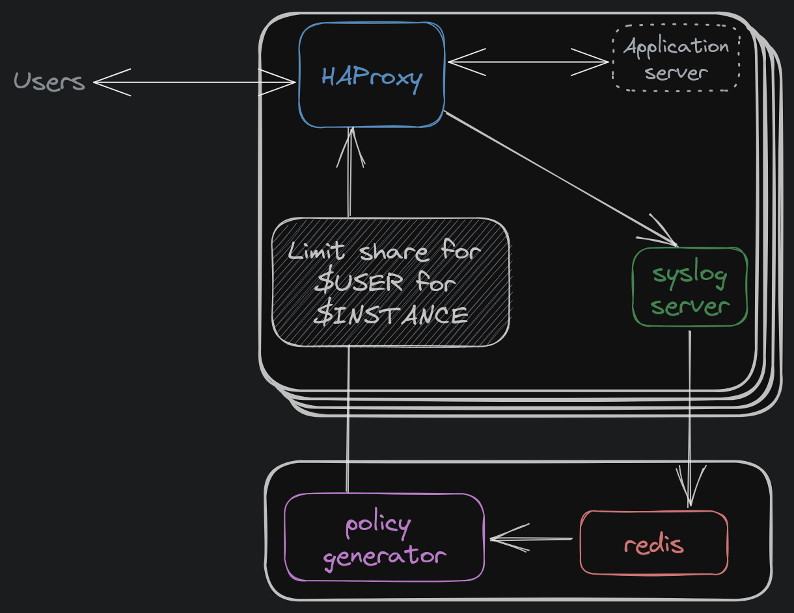

# Limit enforcement

Weir can enforce 3 different types of limits on each user:
- Bandwidth limit (e.g 50MB/s of total upload)
- Request rate limit (applied per HTTP verb, e.g 100 GET requests/s)
- Concurrent request limit (e.g 10 active requests running concurrently)

Each of these get enforced in a slightly different fashion, so we'll detail the strategy for each below

## Request rate limits

Whenever HAProxy begins processing a request, it emits a control message. These get aggregated into Redis as the number of requests with a given HTTP method/verb, made by each user each second.

Whenever polygen gets new request-rate data it compares those counts to the counts it has in the configuration for each user.
If a user has exceeded their limit for a given verb in the current second, a message is sent to each HAProxy instance instructing them to throttle requests for that user/verb combination until the end of the second.

When time ticks over into a new second, the throttle info for the past seconds is discarded and users are permitted to make requests again.

HAProxy keeps a table of all the throttled users for the current second. Whenever a new request comes in it checks that table and if the user is found there, the request is rejected without being processed.

## Concurrent request limits

As for request-rate limits, when HAProxy begins processing a request it emits a control message.
The same happens when the processing of a request ends. As requests begin and end processing, HAProxy internally keeps track of the number of "active" requests that are currently being processed for each user.

When a user reaches their maximum allowed number of concurrent requests, polygen will begin emitting messages to HAProxy that tell it to "block" a user and stop accepting new requests from them.
Much like the request-rate limits, HAProxy maintains a table of blocked users and will reject incoming requests as appropriate.
The difference between request-rate limiting and active-request limiting is that in the case of active-request limiting polygen will continue to emit these "block-user" messages periodically for every user that continues to have too many active requests.

When the user falls below their allowed number of active-requests (by a small margin to prevent flipping back and forth very quickly), a new message is emitted telling HAProxy to "unblock" the user and start allowing their requests to be processed again.

Note that while we do emit both "block" and "unblock" messages, the "block" messages are issued repeatedly so that old "block user" commands will time-out after a while in the event that polygen goes down and also to keep all instances in a consistent state, in case some HAProxy instances are restarted after a user has been "blocked".

## Bandwidth limits

Bandwidth limiting works very differently to request-rate or active-request limiting, in the sense that the decision on whether or not to throttle a user is made in HAProxy rather than in polygen.

Polygen periodically uses the aggregated data from Redis to determine the level of "demand" that each user currently has on each HAProxy instance.
This relative level of "demand" is combined with the configured total bandwidth allowed for that user to generate a "limit-share" where each HAProxy instance is given their own dedicated share of the total allowed throughput.
Each HAProxy then keeps track of the limit-share for all users that have requests actively being processed by that instance and locally enforces that share as the total throughput allowed for that instance.

Any user that does not yet have a limit-share assigned on a given HAProxy instance will instead be allocated a default (generally small) amount of throughput, to allow requests to progress until the system catches up and a more appropriate limit share is received.

In the current implementation, "demand" is just the fraction of the active requests for that user that are being serviced by the given HAProxy instance.
